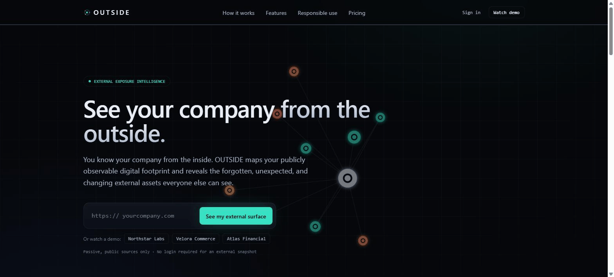

# OUTSIDE

**External digital exposure visualization platform.**
_You know your company from the inside. OUTSIDE shows you what everyone else sees._

Enter a domain and watch your publicly observable digital footprint reveal itself as an
interactive, cinematic asset graph — surfacing forgotten, unexpected, and changing external
assets, using only **passive, public, non-invasive** data sources.

    

<p align="center">
  
</p>

> _Demo above: the landing page → a live cinematic scan → the interactive asset graph with shadow/new-asset overlays → the Attacker View replay. All from the built-in demo dataset (synthetic org, clearly labeled)._

---

## How it works in 20 seconds

1. **Enter a domain.** No login required for an external snapshot.
2. **Watch the scan.** A genuine, stage-based discovery sequence streams over SSE — certificate transparency, DNS, correlation — while assets appear as nodes in real time.
3. **Read the graph.** The hero visualization auto-frames every asset, colour-coded by review priority, with **NEW / RETURNED** rings for changes since the last scan. Search, filter by priority, zoom, and export it as an image.
4. **Understand the exposure.** A transparent 0–100 score (open _"Why is my score 37?"_), evidence-backed findings that separate **observed fact → inferred signal → possible concern**, and one-click plain-English explanations.
5. **Replay it.** **Attacker View** cinematically re-plays how an outsider maps your surface from a single domain — ending with _"In N seconds, N public assets were mapped."_

---

## What this repository contains

This is a **production-standard** implementation built around the product's core differentiator —
cinematic external-surface discovery and visualization — with a full SaaS platform around it. It
runs end-to-end with **zero configuration and no external accounts**; every external capability
activates by env var.

### Built and working today
- **Landing page** — premium dark hero with a live graph backdrop, concept, features, responsible-use, and pricing sections.
- **Passive discovery engine** — real Certificate Transparency (crt.sh) + DNS-over-HTTPS (Cloudflare) providers, with entity resolution and partial-success handling.
- **Cinematic live scan** — genuine **stage-based** streaming over Server-Sent Events (no fake percentages). Assets appear progressively in the graph as they are discovered.
- **Interactive asset graph** — dependency-free canvas force simulation: pan, zoom, node selection, relationship highlighting, priority/kind coloring, progressive reveal, legend.
- **Attacker View** — cinematic replay of how the surface was revealed, ending with _"In N seconds, N public assets were mapped."_ Framed responsibly as discovery, never exploitation.
- **Shadow / non-production / auth-surface classification** — weighted **signal correlation** (not naive keyword matching), each with confidence and a plain-English rationale.
- **Deterministic, explainable exposure score** — a 0–100 posture value with a full _"Why is my score X?"_ breakdown where every component sums to the total.
- **Evidence-backed findings** — every finding separates **observed fact → inferred signal → possible concern**, with reasoning, recommendation, evidence, and discovery method.
- **Temporal tracking & change detection** — repeated scans of a target preserve a stable asset identity across gaps (appears → disappears → returns) and diff into change events (new / returned / disappeared / technology-changed). Works out of the box via a zero-config in-memory store; a **PostgreSQL (Prisma)** backend provides durability when `DATABASE_URL` is set. Real scans never fabricate changes — a stable surface reports zero.
- **PDF report export** — a professionally designed, branded report (executive summary generated deterministically from evidence, score breakdown, findings, change log, asset inventory, methodology) rendered server-side with `@react-pdf/renderer`. One click from the scan view.
- **DNS-TXT domain verification** — real ownership proof: OUTSIDE issues a per-domain token, the user publishes it as a TXT record, and a DNS-over-HTTPS check flips the target from **Unverified external view** to **Verified organization**. Token binding, verification state, and the check are implemented and persisted.
- **Accounts, organizations & RBAC** — email/password auth (scrypt hashing, HMAC-signed httpOnly session cookies), a personal organization per user, membership roles (`owner > admin > analyst > viewer`) enforced server-side. No external auth service required.
- **Monitored targets & scheduled scans** — organizations track domains on a daily/weekly cadence (per-plan limits enforced server-side). A protected cron endpoint (`/api/cron/scan`) claims due monitors and runs real passive scans idempotently — serverless-friendly, no Redis/worker needed.
- **Intelligent change alerts** — after a scheduled scan, meaningful changes (new/returned assets, high-priority shifts) are grouped into a single email per monitor and sent to the org's members. Provider-abstracted email with a console dev transport (zero-config) and Resend for delivery.
- **Read-only AI explanation layer** — provider-abstracted executive summaries; deterministic template by default, Anthropic when a key is present. It can never invent assets, findings, or scores.
- **Stripe billing** — subscription checkout, billing portal, and a signature-verified, idempotent webhook that syncs plan/subscription state; plan limits enforced server-side. Fully env-guarded (free plan works with no Stripe keys).
- **Demo mode** — three synthetic organizations (Northstar Labs, Velora Commerce, Atlas Financial) with a designed discovery storyline and change story, clearly labeled as synthetic.
- **Security layer** — target normalization, SSRF/private-range/metadata guards, and rate limiting, all unit-tested.

### Remaining roadmap
The major systems above are built. Remaining polish is specified in
[`docs/ROADMAP.md`](docs/ROADMAP.md): OAuth sign-in and team invites (credentials auth ships today),
file-based (`/.well-known`) domain verification as a fallback, a durable webhook-idempotency table,
certificate-change detection, and the historical graph-diff view. The domain models in
[`lib/types.ts`](lib/types.ts), [`lib/persistence`](lib/persistence), and [`lib/auth`](lib/auth)
already reflect the design these build on.

**Zero-config vs. durable.** Everything runs immediately on in-memory stores (reset on restart). To
persist accounts, monitors, and scan history, set `DATABASE_URL` and run `npm run db:push`. Optional
capabilities activate purely by presence of their env vars — see [`.env.example`](.env.example):
`ANTHROPIC_API_KEY` (AI summaries), `RESEND_API_KEY` (email delivery), `CRON_SECRET` (scheduler),
`STRIPE_SECRET_KEY` + price/webhook vars (billing).

> This split is deliberate and honest: see [Technical honesty](#technical-honesty).

---

## Quick start

```bash
npm install
npm run dev        # http://localhost:3000
```

No `.env` is required. Try it immediately:
- Click a demo org (**Northstar Labs**) on the landing page, or
- Enter any real domain (e.g. `example.com`) to run a live passive scan.

### Scripts
| Command | Purpose |
| --- | --- |
| `npm run dev` | Start the dev server |
| `npm run build` | Production build (runs lint + typecheck) |
| `npm run start` | Serve the production build |
| `npm run typecheck` | `tsc --noEmit` (strict) |
| `npm run test` | Run the Vitest suite |
| `npm run lint` | Next.js lint |

---

## Architecture at a glance

**Next.js 14 (App Router) + TypeScript, single deployable.** One app keeps infrastructure
complexity low and handover trivial while still supporting SSR, API routes, and streaming.

```
Providers ─▶ Raw observations ─▶ Normalization ─▶ Entity resolution
   ─▶ Graph construction ─▶ Classification (signals) ─▶ Scoring ─▶ Findings ─▶ (AI explanation)
```

- **Discovery** — [`lib/discovery`](lib/discovery): modular providers (`providers.ts`), bounded/timed fetch + concurrency pool (`net.ts`), and the orchestrating `engine.ts` (demo + passive paths share one classification/scoring pass).
- **Analysis** — [`lib/analysis`](lib/analysis): `signals.ts` (correlation-based classification), `findings.ts`, `scoring.ts` (deterministic).
- **Security** — [`lib/security`](lib/security): `target.ts` (normalization + SSRF guards), `ratelimit.ts`.
- **Streaming API** — [`app/api/scan/route.ts`](app/api/scan/route.ts): SSE with a typed event contract (`lib/types.ts`).
- **UI** — [`components`](components): canvas graph, live console, node detail, summary/score, Attacker View.

Full rationale, tradeoffs, and the data model are in [`docs/ARCHITECTURE.md`](docs/ARCHITECTURE.md).

### Key decisions
- **No graph database.** External surfaces of a single org are small (tens–hundreds of nodes). A relational store with a temporal snapshot model (roadmap) is simpler, cheaper, and sufficient. A graph DB would be fake enterprise complexity here.
- **Custom canvas graph, no library.** Guarantees performance, a distinctive look, and zero dependency risk during due diligence.
- **Deterministic core.** Discovery, correlation, scoring, and timestamps are fully deterministic and testable. AI is confined to explanation only and can never invent assets, findings, or evidence.

---

## Security & responsible use

OUTSIDE is a **defensive** product. It maps an organization's own public footprint; it contains no
exploitation, brute-force, credential, payload, or unauthorized-access capability, by design.

- **Passive by default** — only public CT and DNS sources are queried.
- **SSRF & egress guarded** — [`lib/security/target.ts`](lib/security/target.ts) normalizes targets and refuses IP literals, private/loopback/link-local/CGNAT ranges, and the `169.254.169.254` cloud-metadata endpoint at a single tested chokepoint.
- **Bounded scans** — per-scan host caps, request timeouts, and concurrency limits.
- **Rate limited** — fixed-window limiter per client (swappable for a shared store in production).
- **Ownership verification (roadmap)** — deeper inspection is gated behind DNS-TXT / file verification; unverified targets get a clearly-labeled external view.

See [`docs/SECURITY.md`](docs/SECURITY.md) for the full threat model and abuse-prevention design.

---

## Technical honesty

Per the product's own guiding principle — _honest over impressive-but-fake_ — a few notes:
- **Real scans never fabricate.** If a provider fails or evidence is weak, the UI says so; unknown is shown as unknown.
- **Demo data is synthetic and labeled.** Demo organizations use reserved `.example` TLDs and are badged as demo everywhere they appear.
- **The roadmap is documented, not stubbed.** Rather than ship non-functional billing/auth/worker scaffolding pretending to be complete, those are specified in [`docs/ROADMAP.md`](docs/ROADMAP.md) with the integration points the current code already exposes.

---

## Testing

```bash
npm run test
```

22 tests cover target normalization, the SSRF/private-range guard (IPv4 + IPv6), CT entity-resolution
boundary handling, signal classification, deterministic scoring (sum-equals-total), and findings.
The suite does **not** depend on live internet access — it runs against fixtures and the deterministic
demo dataset.

## Deployment

Deploys as a single Next.js app to any Node host (Vercel, Fly.io, a container, or bare Node).
`npm run build && npm run start`. See [`docs/ARCHITECTURE.md`](docs/ARCHITECTURE.md#deployment).

## License
Proprietary — prepared for portfolio presentation and potential acquisition.
